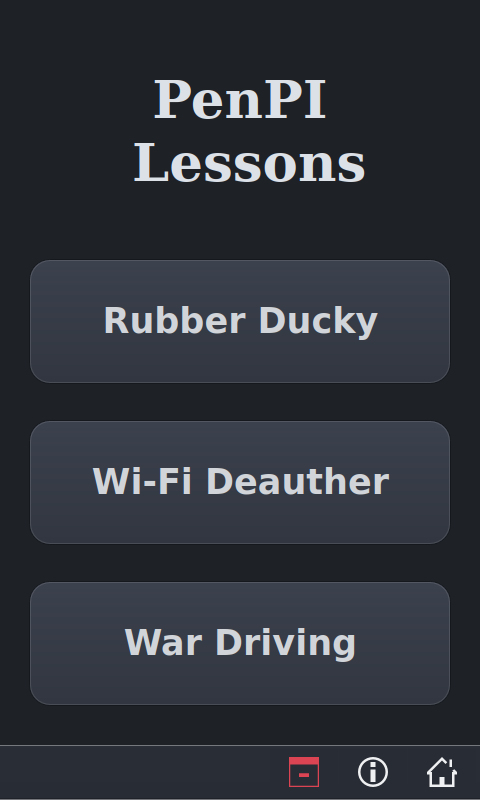
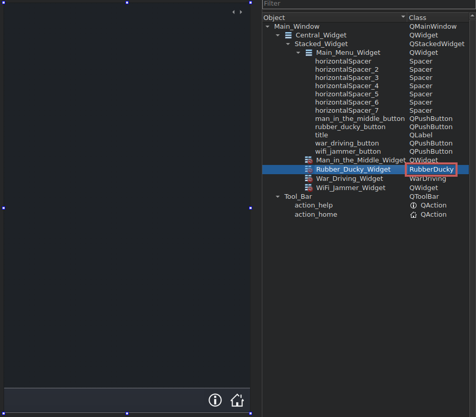

Main Window UI
=============

<strong><i>Main Winodow UI</iz></strong>

 * The above menu provides three buttons for accessing each attack
 * The home button, located on the bottom right returns the user to the main menu.
 
 
### *Custom Widget UI*
 
 
<strong><i>Custom Widget UI</iz></strong>

 
The page above is one of three seperate pages for each attack

 * Each page acts a place holders for the attack's UI
     - This place holder is known as a Custom Widget.
  * The Custom Widget are defined in a seperate module denoted by the area enclosed in the red rectangle
      - For example, the UI for the Rubber Ducky Attack is found in the RubberDucky class

