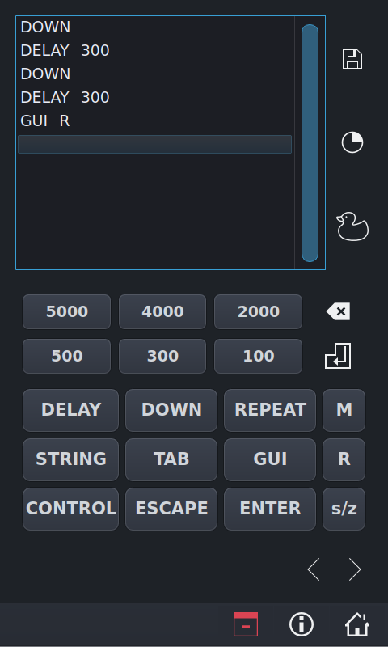
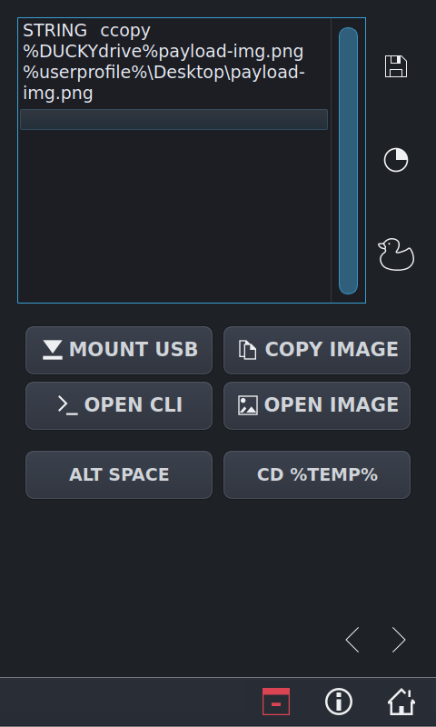

Rubber Ducky UI
=============

<strong><i>Rubber Ducky UI Page 1</iz></strong>

- The buttons below the Script View will insert the respective commands into the script.
- The delete key, to the right of the number buttons, deletes the currently selected line.
- The enter key, below the delete key, inserts a new line after the currently selected line.
- The save icon saves the currently created script to a text file. The file is stored in the users current home directory.
- The pie symbol, below the save icon, mounts the raspberry pi pico and sets the pico up as a rubber ducky.
- The ducky icon copies the saved text file and background image to the pico.

<strong><i>Rubber Ducky UI Page 2</iz></strong>

- The arrows, along the button, switches between button pages.
- The macro buttons, on page 2, insert sets of commands that only appear once in the script that the students will be creating.

## __*Known Bugs*__
- Saving the script to a text file is broken on the PenPi
    - The home folder is not currently set up correctly on the PenPi.
    - The save path is currently handled based on the home directory.
- The Raspberry Pi Pico setup button is not currently working.
- The Rubber Ducky setup button is not currently working.