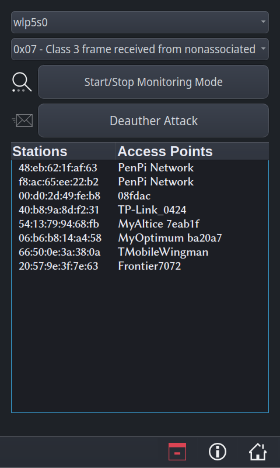
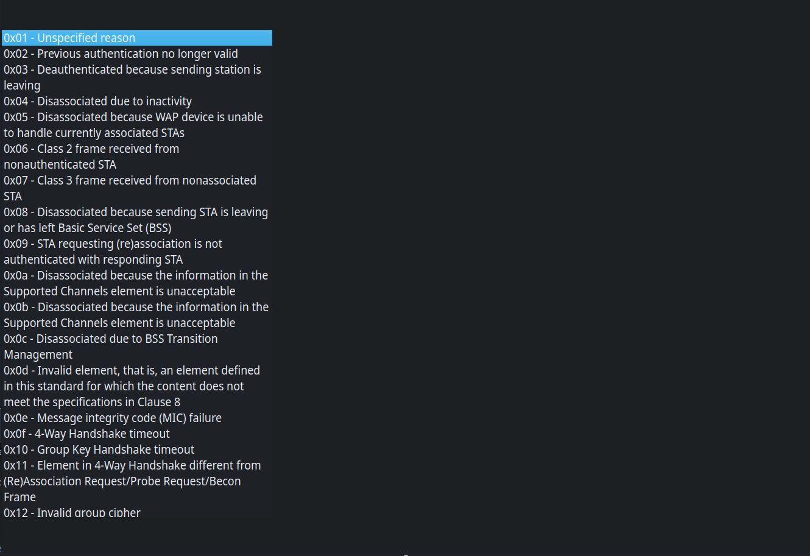

Wi-Fi Deauther UI
=============

<strong><i>Wi-Fi Deauther UI</iz></strong>

- The Network Interface combobox is the first combobox. The user will select their device's wireless interface that will be used to carry out the attack.
- The Reasons List is the second combobox. This allows the user to select the reason the device wants to disconnect.
- The Monitoring Mode button creates a monitoring interface from the selected network interface. The new monitoring interface can filter nearby network traffic.
- The Deauth Attack button will send deauth packets to the selected device in the table. These packets will tell the access point that the device at the selected mac address wants to disconnect for the reason specified in the second combobox.
- The table lists the mac address of nearby devices found by the monitoring interface.

## __*Known Bugs*__

- The frame for Reasons List dropdown extends beyond the length of the text.
    - QComboBox does not support word wrapping. Word wrapping can be achieved by creating a list view, enabling word wrapping for the list view, and assigning the list view to QComboBox.
    - The text will wrap to the next line, but the frame stays the same length.
    - Most of the excess frame was off screen on the PenPi, so the issue was less noticable.

- The combobox frequently closes immediately after opening.
    - This is a calibration issue that may either stem from the touchscreen calibration or Qt's handling of input. 
    - This is can be worked around by pressing the combobox and dragging your finger to the option you would like to select.

- The Deauth Attack causes input lag on the PenPi.
    - This issue was not observed while testing on a higher end system.
    - The mail icon blinks erratically and the deauth button sometimes doesn't respond to input.
    - This may be resolved by using QThreads in a similar manner to how we handled packet filtering.
    - The attack could be running in it's own thread, without effecting the apps ui.

